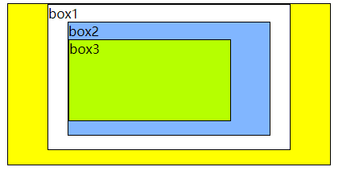

# 由 CSS 浮动清除谈及 Float、Position 属性和 BFC 块格式化上下文（一）
---

## 引子

本文的起因在于我在重现一道学习网站上的布局时，自己编写的代码得到的导航栏布局结果如下：

而实际正确的结果如图：

可以很明显的看出问题所在：底部的 footer 背景蔓延到了主区域。

这是因为主内容区域设置了 float:left; 一方面可以使主内容区的 sidemenu 边栏和 content 文章内容形成单行布局，但也使它们在普通流中脱离了父容器，父容器没有把浮动的子元素包围起来，造成了父元素的塌陷，这就需要清除父容器两边的浮动，使父容器能够撑开。

回到本文的导航栏布局，可以采用一个非常经典的方法来清除浮动：

	.clearfix::after {
	    content: "";
	    clear: both;
	    display: table;
	}

其中，将包括 sidemenu 边栏和 content 文章内容的主体区域放在一个大类 clearfix 中。

## Float、Position 属性

### 1. HTML 布局

首先要对 HTML 布局的两个基本概念有清楚的认识。

### 1.1 盒子模型

HTML中元素的盒子模型分为两种：**块级元素（Block）**和**内联元素（Inline）**。两种盒子模型区别如下：

1. 块级（Block）类型的元素会独占一行，内联（Inline）类型的元素则都会在一行内显示直到该行排满，前后不会自动换行（但可以通过设置 display：block/inline/inline-block 改变元素的布局方式）；

2. 默认情况下，Block 元素宽度默认为其父元素宽度的 100%，内联（Inline）元素根据自身的内容及子元素来决定宽度；

3. 块级（Block）类型的元素可以设置 width、height 属性，而内联（Inline）类型设置无效；

4. 块级（Block）元素可以设置水平和垂直方向的 margin 和 padding 属性；内联（Inline）元素水平方向的padding-left, padding-right, margin-left, margin-right都会产生边距效果，但垂直方向的padding-top, padding-bottom, margin-top, margin-bottom不会产生边距效果。

列举一些常见的元素分类：

- 块级元素有 DIV, FORM, TABLE, P, PRE, H1~H6, DL, OL, UL 等。

- 常见的内联元素有 SPAN, A, STRONG, EM, LABEL, INPUT, SELECT, TEXTAREA, IMG, BR 等。

### 1.2 HTML 普通文本流

浏览器在读取HTML源代码的时候是根据元素在代码出现的顺序读取，最终元素的呈现方式是依据元素的盒子模型来决定的。行内元素从左到右，块状元素从上到下按顺序排列。

元素在HTML的普通流中会“占用”一个位置，而“占用”位置的大小、位置则是由元素的盒子模型来决定。但有一些方法可以使元素脱离 HTML 的普通文本流。

### 2. Position 定位

position 的属性值共有四个 static、relative、absolute、fixed、sticky。

#### static

HTML 元素的默认值，即没有定位，遵循正常的文档流对象。静态定位的元素不会受到 top, bottom, left, right 影响。

#### relative

俗称相对定位，相对定位元素的定位是**相对元素的默认位置**，即将元素偏离元素的默认位置，但普通文本流中依然保持着原有的占用空间，并没有脱离普通文本流，只是元素发生视觉上发生的偏移。

相对定位元素后的正常文本流中元素会根据相对定位元素原本的位置向下排列。相对定位并不会改变内联（Inline）元素的display属性。

	
	
	
orange

	
lightblue

	
lightgreen

相对定位元素经常被用来作为绝对定位元素的容器块。

#### absolute

俗称绝对定位，绝对定位的元素的位置相对于最近的已定位父元素，如果元素没有已定位的父元素，那么它的位置相对于<html>根节点。

应用了 position: absolute 的元素会脱离页面中的普通文本流，不占用空间，宽高塌陷，在普通文本流之上（z-index），并改变 display 属性，所以会与其他元素发生重叠。

	
	

		
orange

		
lightblue

		
lightgreen

	

如果设置的是 inline-block，lightgreen 框就不会在 orange 后，而是另起一行。

## Float 带来的困扰

浮动布局虽然能带来一定便利，但也产生了新的问题。

### 问题1 float 元素占用的空间

还是拿 3.2 中代码来说，如果 lightblue 和 lightgreen 没有设置 float 属性，就会产生如下效果：
 

orange 框遮住了后面两个框的一部分，这是因为 float 元素虽然脱离了普通文本流，不占据**块级空间**，但会占据另外的空间，引用 [关于css float 属性以及position:absolute 的区别](https://www.cnblogs.com/enemy/p/3750588.html) 文中的话：

> 浮动元素会占据另外的空间，也就是行框空间，通俗的讲就是文本所占的空间

即浮动元素会影响**块级元素之内的文字以及内联元素**，所以才能实现文本环绕效果。

### 问题2 float 元素导致的父元素塌陷

	<!doctype html>
	<html lang="en">
	<head>
	    <meta charset="UTF-8">
	    <title>Clear float</title>
	    
	</head>
	<body>
	    

	        

	            

	            

	            

	        

	    

	</body>
	</html>

实际的结果是这样的：

但我们希望看到的是有橙色边框包围三个盒子，这就是因为父容器并没有把浮动的子元素包围起来，父子间的 margin 和 padding 设置值不能正确被显示，俗称塌陷。

下一章具体讨论如何清除父元素塌陷和什么是 BFC 的问题。

# 参考文档

[对CSS中的Position、Float属性的一些深入探讨](http://www.cnblogs.com/coffeedeveloper/p/3145790.html#html)

[菜鸟教程-CSS Position](http://www.runoob.com/css/css-positioning.html)

[关于css float 属性以及position:absolute 的区别](https://www.cnblogs.com/enemy/p/3750588.html)
